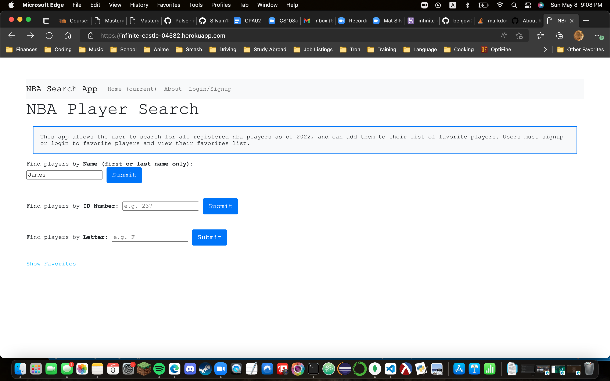
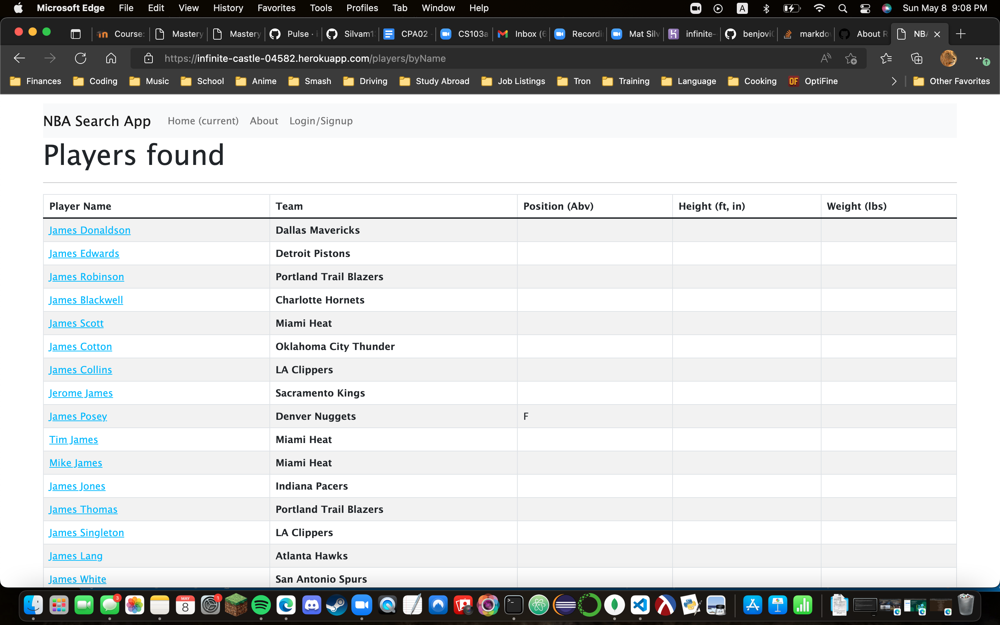
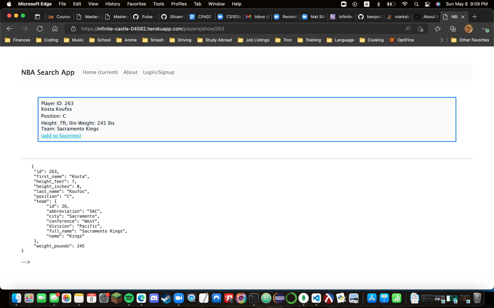
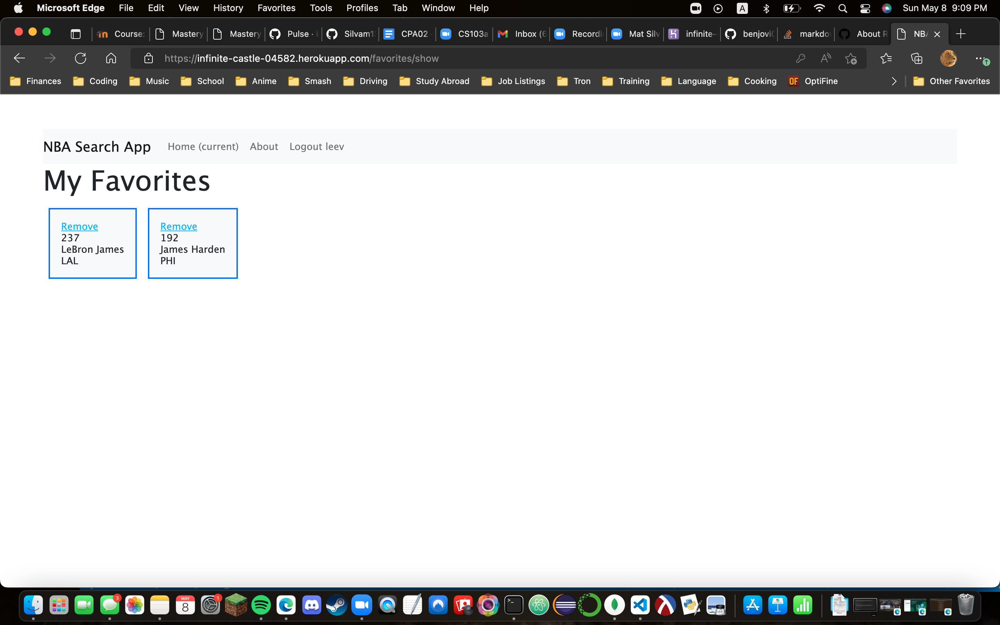

# CS103a CPA02 App

This is an app which allows the user to create an account
to view an api database of all registered players in the NBA 
as of the year 2022, as well as create a list of favorite players.

## Using the App
On the main page, the user can search for players by either their first 
or last name, their id number, or by letter. 


From there, they can click on the player's name to get the page of the player's info.



Users must be signed in or logged in to add the player to their list of favorite players.
These players can also be removed from the list. 


## Installation
Download the project from github and download nodejs and npm from https://nodejs.org
and cd into the folder

Install the packages with
``` bash
npm install
```
Start the project with
``` bash
npm start
```
or install nodemon (the node monitoring app) with
``` bash
npm install -g nodemon
```
and start the project with
``` bash
nodemon
```

## Videos

[App Demo](https://brandeis.zoom.us/rec/play/2ljZMKiTXKGHNmPKFrIRDZ8dFnIjhaSELPYBLKbeWEkWBs4WtMSINI8GgRx0c_Dv0PPdjLX__6rgZCYk.cDplmn7i0qic4VPr?autoplay=true&startTime=1652059143000)
